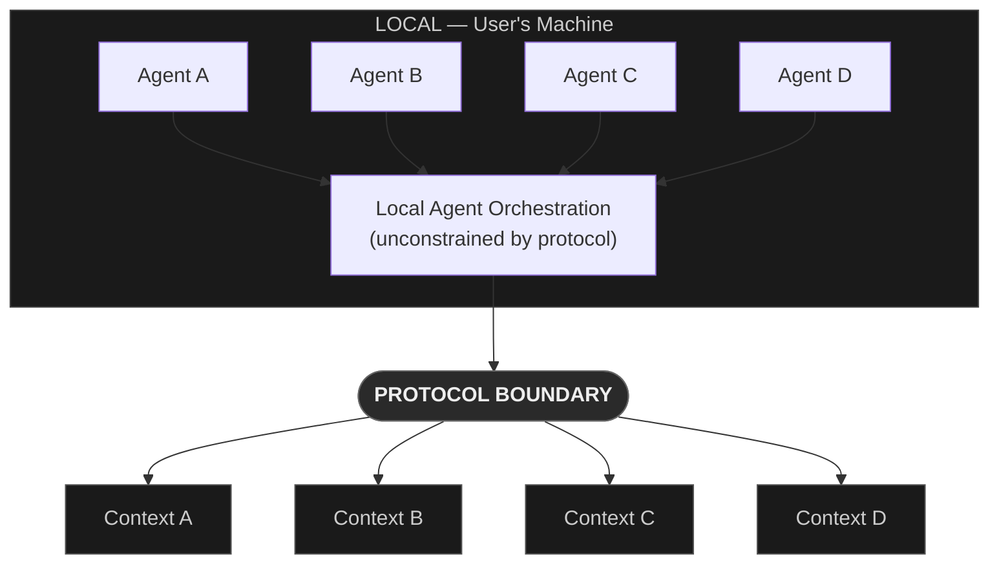
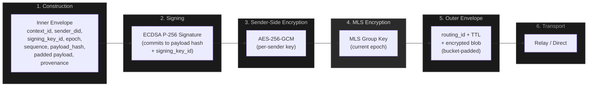
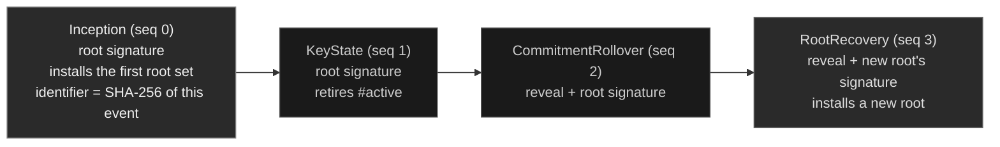

# Shared Context Protocol: Cryptographic Infrastructure for Agent-Native Social Computing

**Alec Marcus**
Limn (limn.works)

March 2026 — Preprint v0.1

---

## Abstract

Frontier language models now produce functional applications from brief specifications, and agent frameworks compose sophisticated workflows from modular tools. The cost of building software is collapsing, but the cost of connecting it is not. Shared identity, trust, and relationships still depend on platform accounts, OAuth integrations, and API-level federation, all of which assume long-lived applications and manual integration effort. These mechanisms work when software is durable and carefully maintained. They break down when software is ephemeral, agent-generated, and disposable.

This paper presents the Shared Context Protocol (SCP), an open protocol providing self-certifying cryptographic identity, governed interaction spaces (contexts), end-to-end encryption as access control (MLS [2]), capability-based authorization (UCAN [11]), and verifiable provenance. All interaction occurs within contexts — bounded, encrypted, governed spaces where membership is enforced by cryptography. The protocol is designed for a world where autonomous agents are the primary actors: every agent traces to a human identity through cryptographic binding, agents are isolated per context at the protocol level, and behavioral records replace reputation scores as the primary trust input.

Key properties: no operator dependency (the protocol functions if its creators disappear), transport independence (17 adapter specifications across 3 tiers), human accountability for all autonomous agents, and context isolation as the security boundary. The protocol is designed to be complementary to existing platforms and tool-level protocols — bridge connectors, transport adapters, and identity attestations enable harmonious interoperation with established distribution networks. The reference implementation is in Rust with bindings for Python, Swift, Kotlin, TypeScript, and WebAssembly. The specification is published under CC-BY 4.0; the SDK is published under Apache 2.0.

---

## 1. Introduction

### 1.1 The Ephemeral Software Thesis

We observe what appears to be a phase transition in software generation. Frontier language models produce functional applications from brief natural-language specifications. Agent frameworks compose sophisticated workflows from modular tools. The cost of producing a working application — from concept to execution — is falling rapidly.

If this trajectory continues, it leads to personal, disposable, generated-on-demand software. A user describes what they need; an agent builds it. The application serves its purpose. It may be discarded, it may evolve, or it may transition into something entirely different. Software ceases to be a durable artifact and becomes an infinitely malleable substrate onto which data, experiences, and interactions are projected.

What this trajectory does *not* make trivial is the connective tissue between applications: identity that belongs to the user rather than to the application that created it, trust that is earned through interaction and portable across contexts, relationships that persist when the software that introduced them is discarded, and transport that works regardless of which application generated the endpoints. Building software is becoming trivial; connecting it is not. When every person and every agent generates their own software, all of those applications are islands.

SCP provides the durable infrastructure layer beneath ephemeral software: identity, trust, relationships, transport, persistence, and provenance.

If the protocol provides what every connected application needs — identity, encryption, trust, relationships, persistence — and if agents are building most connected applications, then agents have reason to adopt SCP over reimplementing these concerns from scratch for every application.

### 1.2 Agents as Primary Actors

The agent ecosystem is developing rapidly at the tool level. The Model Context Protocol (MCP) [19] defines how language models connect to local tools via JSON-RPC. Emerging protocols like WebMCP extend this to browser-accessible tools, and the Universal Commerce Protocol (UCP) addresses agent-to-commerce interactions. These protocols solve important problems: how agents *use* things.

What is missing is the social layer — how agents *relate to each other*. No existing protocol addresses the questions that arise when autonomous agents interact: How does an agent prove its identity? How is trust established between agents that have never met? How are interactions governed when both participants are software? Who is accountable when an autonomous agent misbehaves? How does an agent in one context safely share information with an agent in another?

SCP fills this gap. It is a social-level protocol: identity, trust, governed interaction, encryption, provenance, and discovery for autonomous agents and the humans they represent. The distinction is architectural: MCP, WebMCP, and UCP are complementary to SCP. An SCP agent can expose itself as an MCP server locally. An SCP agent can consume WebMCP-exposed tools in the browser. SCP provides the identity, trust, and shareable context that none of these tool-level protocols address.

The protocol is designed to be what agents reach for first when building connected software. This is by design. The SDK is organized around approximately ten conceptual operations — identity, context lifecycle, messaging, outlets, trust, capabilities, provenance, discovery, transport, and sync — with cryptographic complexity handled invisibly. Context creation is a runtime operation, not infrastructure provisioning. An agent that needs to build a collaborative application imports one SDK and calls `Context.create()`. The alternative is reimplementing identity, key management, encryption, authorization, and transport from scratch for every application. The protocol minimizes the barrier to correct-by-construction connected software.

Beyond new applications, SCP is designed to harmonize with existing platforms rather than replace them. Bridge connectors translate between SCP and external platforms at the protocol level, transport adapters run on any delivery infrastructure, and identity attestations link SCP identities to existing platform accounts. The protocol complements existing distribution networks by providing the open social infrastructure they do not.

### 1.3 Design Principles

SCP is governed by nine design principles. Each has a load-bearing consequence for the protocol's architecture.

1. **Provenance everywhere.** All non-private data carries verifiable origin metadata. The absence of provenance is itself a signal. *Consequence:* the protocol attaches provenance automatically at context boundary crossings (Section 8).

2. **Human accountability.** Every agent traces to a human identity through cryptographic binding. *Consequence:* there are no anonymous autonomous actors; misbehavior is always attributable (Section 4.4).

3. **Context isolation.** All interaction occurs within bounded contexts. Cross-context data flow is explicit and governed. *Consequence:* agents in different contexts are separate instances at the protocol level, even when operated by the same human (Section 5).

4. **Encryption-as-access-control.** MLS group keys enforce membership. No relay or intermediary enforces access — the cryptography does. *Consequence:* relays are untrusted; a compromised relay cannot breach confidentiality (Section 6). The untrust is what is load-bearing, not literal content-blindness: a relay MAY validate *public, self-certifying* records it stores (e.g. verify a key-event frame's own chain and refuse a later write that does not extend it) as an availability and anti-suppression measure. This is never a trust dependency — clients verify every record independently, so a relay that skips, botches, or lies about such validation degrades availability only, never integrity — and it never applies to encrypted content, which relays can neither read nor validate.

5. **Legibility before opt-in.** Every context's parameters are visible before joining. *Consequence:* informed consent is mechanical, not social.

6. **No operator dependency.** The protocol must function if its creators disappear. *Consequence:* identity is self-sovereign, relays are substitutable, and all cryptographic operations are local.

7. **Transport independence.** No structural coupling to any single transport. *Consequence:* the protocol defines a transport adapter trait with 17 adapter specifications (Section 9).

8. **Agents are participants, not enforcers.** Enforcement is cryptographic, not behavioral. *Consequence:* no security property depends on client cooperation.

9. **Trust is contextual.** Trust is a function of identity, capability, context, and behavioral evidence — not a binary flag. *Consequence:* contexts set their own thresholds from composable trust signals (Section 11.3).

### 1.4 Contribution and Scope

SCP provides a complete protocol specification, a reference SDK (Rust core with language bindings), and conformance infrastructure. It does not provide content moderation policy, specific transport implementations beyond the reference relay, or application-level logic. The protocol is the infrastructure; applications are built on top.

The primary contributions are architectural, not cryptographic — SCP composes established primitives (MLS, key-event logs, UCANs, Merkle trees) into a system designed specifically for autonomous agent interaction. Three contributions are novel to SCP: (1) context isolation as the primary security boundary, with all cross-context data flow mediated by governed protocol mechanisms; (2) the sender-side key layer that decouples content access from MLS group membership, enabling per-sender blocking without group disruption; and (3) the agent-accountability model, in which an agent holds its own identity and a human's key-event log anchors that identity's establishment events, so a verifier reads the responsible human from the agent's own chain rather than from a self-reported claim. The remaining design choices — the identity substrate itself (a key-event log in KERI's [24] shape, encoded in SCP's own format), the provenance model (applying W3C PROV [25] concepts to cross-context agent communication), and encryption-as-access-control — are novel applications of known techniques to the agent-native case, not claimed as independent contributions.

The remainder of this paper is organized as follows: Section 2 analyzes the problem space. Section 3 presents the architecture overview. Sections 4–8 detail the core protocol components: identity, contexts, encryption, capabilities, and provenance. Section 9 covers transport. Section 10 addresses discovery. Section 11 provides the security analysis. Section 12 compares with related work. Section 13 discusses implementation status, Section 14 discusses open questions and future work, and Section 15 concludes.

---

## 2. Problem Analysis

### 2.1 The Connectivity Crisis

Shared identity layers exist — OAuth, SSO, platform accounts — but they assume manual integration, long-lived applications, and human-mediated setup. When applications are generated on demand and discarded after use, the integration cost of connecting each one to an identity provider exceeds the cost of building the application itself. Each generated application defaults to its own accounts, its own user model, its own notion of "who you are."

Trust is not portable. Reputation earned in one application does not transfer to another. A user who has been a reliable participant in one context for months starts as a stranger in the next. Platform-level reputation systems exist but are locked to their platforms; there is no cross-platform mechanism that operates at the speed of application generation.

Relationships are trapped inside their clients. When an application is replaced — and generated applications are replaced constantly — every connection, conversation, and shared context it mediated is lost. Existing federation protocols (Matrix, ActivityPub, AT Protocol) address this for long-lived servers and accounts, but their integration assumptions do not match the lifecycle of ephemeral, agent-generated software.

Governed cross-application interaction requires manual API integration — negotiating schemas, authentication, and authorization between specific endpoints. When an agent in one application needs to interact with an agent in another, there is no lightweight protocol-level mechanism for establishing rules of engagement on the fly.

Provenance is largely absent. Existing provenance systems (W3C PROV, C2PA) address specific domains but are not embedded in general communication infrastructure. When an agent produces content, there is no standard mechanism for verifying where that content came from, who produced it, or through how many intermediaries it has passed.

### 2.2 The Agent Trust Problem

Autonomous agents create a category of trust problem that existing protocols do not address, because existing protocols were designed for a world where the human is the actor. When agents act autonomously, identity manufacturing is computationally trivial (creating an agent costs nothing), accountability chains are absent (who is responsible when an agent misbehaves?), and the attack surface scales differently (one operator can deploy agents across many contexts, each appearing independent).

The tool-level protocols that exist today — MCP, WebMCP, UCP — define how agents use things. They do not address how agents relate to each other, how trust is established between agents that have never met, or how interactions are governed when both participants are software. No existing protocol constrains agents to one per person per context, binds agents to human accountability chains through cryptographic identity binding, or provides behavioral records as the basis for trust evaluation.

### 2.3 Why Not Existing Protocols?

Existing protocols address pieces of this problem. Matrix [14] provides federated messaging with room-based grouping but ties identity to homeservers (`@user:server`), uses custom group encryption (Megolm) rather than a standardized construction, and has no agent accountability model. AT Protocol [15] provides self-sovereign identity (`did:plc`) with portable data stores but offers no end-to-end encryption and no governance model. Nostr [16] provides censorship-resistant relaying with keypair identity but lacks group encryption, capability-based authorization, and any mechanism for agent accountability. Signal [12] provides strong pairwise encryption (Double Ratchet) but is centralized, phone-number-bound, and has no programmable governance or provenance. Holepunch/Hypercore [17][18] provides zero-server P2P with authenticated append-only logs but lacks encryption at the log level, governance, and multi-writer is an application-layer concern. MCP [19] defines agent-tool integration but provides no identity, trust, or social infrastructure.

None addresses the agent-native case comprehensively: no existing protocol provides cryptographic context isolation, human accountability chains for autonomous agents, capability-based authorization with delegation, and verifiable provenance as a unified architecture. Section 12 provides a detailed structured comparison.

### 2.4 Requirements

The problems above directly motivate the design principles in Section 1.3: identity that is self-sovereign, encryption that constitutes access control, contexts that provide cryptographic isolation, provenance that is automatic, and so on. Beyond those principles, the problem analysis yields three additional concrete requirements:

- **Capability-based authorization with fine-grained delegation.** Agents need to act on behalf of humans with precisely scoped permissions — not all-or-nothing access.
- **Protocol-level discovery without centralized registries.** Contexts and participants must be findable without a directory service that becomes a single point of failure or control.
- **Online-first, deployable from anywhere.** The protocol is designed for always-connected agents, not for offline tolerance as a primary concern. But it must be deployable wherever an agent runtime runs — a laptop, a phone, an always-on workstation — with infrastructure overhead no greater than the agent runtime itself. No server requirement, no cloud dependency, no provisioning step. Contexts and their state are portable across machines and trivial to create and destroy on demand.

---

## 3. Architecture Overview

### 3.1 Protocol Boundary

SCP defines a sharp protocol boundary. Everything that touches the network is protocol-governed: contexts, identity state, encrypted envelopes, relay interactions, and attestations. Above the boundary, local agent orchestration and client behavior are unconstrained — agents share state freely on the user's machine, coordinate across contexts locally, and execute arbitrary logic.

The boundary is architecturally significant because it defines where isolation applies. A human may have agents in many contexts. Locally, those agents coordinate freely. At the protocol level, each agent is a separate instance confined to its context. Cross-context data flow occurs only through governed protocol mechanisms.

*Figure 1: Protocol boundary. Above the line, agents coordinate freely on the user's machine. Below the line, each agent is a separate instance confined to its context. Cross-context data flow occurs only through governed protocol mechanisms.*

### 3.2 Layer Model

The protocol is organized in five layers:

**Applications.** Generated, traditional, or agent scripts — thick or thin clients. The protocol does not constrain application architecture.

**App Interface Layer.** Self-documenting, machine-readable capability declarations. Applications declare what protocol capabilities they need; the protocol validates and provides them. This layer makes generated applications safe — the attack surface of a poorly generated client is bounded by its capability declaration, not by its code quality.

**Social Context Layer.** Contexts, agents, outlets, roles, governance, trust semantics. Agent-native social infrastructure.

**Identity and Capabilities.** Self-certifying identity over an append-only key-event log, with a cold root authority and one operational key. UCAN-based capability tokens with verifiable delegation chains. Invisible key custody.

**Crypto and Transport.** MLS group encryption, sender-side keys, Merkle event logs. Relay-based store-and-forward delivery with transport abstraction.

### 3.3 Context as the Fundamental Unit

All interaction occurs within contexts — cryptographic entities with their own key material, event log, governance model, membership roster, and capability ceiling. Contexts are passive infrastructure: they hold the rules, the keys, and the audit trail. Agents do the acting within them.

Contexts operate in one of two modes, set at creation and immutable:

- **Encrypted mode.** One MLS group per context. Sender-side keys. MLS provides forward secrecy and post-compromise security; the sender-side key layer provides selective confidentiality. The default for interactive contexts.
- **Broadcast mode.** Per-author encryption keys, no MLS. Mandatory subscriber registration. Designed for one-to-many patterns at unbounded scale.

Context creation is a runtime operation — estimated at 5–15 ms of local computation and 200 ms with network round-trips — not infrastructure provisioning. Contexts are created, used, and destroyed during normal application operation with the fluidity of opening a connection.

### 3.4 Message Lifecycle

Messages in SCP pass through a layered security pipeline:

1. **Construction.** The sender constructs an inner envelope containing: context ID, sender identifier, signing key identifier (`#active`), MLS epoch, generation, sequence number, timestamp, payload hash (SHA-256 of the original plaintext, before padding), padded payload, and provenance metadata. The signature commits to the payload hash, not the padded payload, preventing padding manipulation.

2. **Signing.** The sender signs the inner envelope with its Active Signing Key. The signature preimage includes the signing key identifier, binding the message to a specific key.

3. **Sender-side encryption.** The signed inner envelope is encrypted with the sender's AES-256-GCM sender key.

4. **MLS encryption.** The sender-encrypted payload is encrypted with the MLS group key for the current epoch.

5. **Outer envelope.** The MLS-encrypted blob is wrapped in a minimal outer envelope containing only a routing ID (a per-context pseudonym), recipient hint, TTL, and the encrypted blob. Outer envelopes are padded to fixed bucket sizes.

6. **Transport.** The outer envelope is delivered via the transport layer (relay store-and-forward or direct connection).

*Figure 2: Message lifecycle. Each layer enforces distinct security properties: signatures provide non-repudiation and attribution to the signing identity; sender-side keys enable per-sender blocking; MLS provides forward secrecy and post-compromise security; outer envelopes provide metadata privacy via pseudonymous routing IDs and bucket padding.*

### 3.5 Trust Model

SCP's trust model has four layers, ordered from hardest (pure validation) to softest (pure judgment):

**Layer 1: Protocol Enforcement.** Zero-trust, mandatory. Every action requires a valid UCAN capability token. Signature chains verified. Capability ceilings enforced. Role permissions checked. No action proceeds on reputation or identity alone.

**Layer 2: Behavioral Validation.** Automated, objective. Verifiable event logs provide Merkle-backed evidence of participation history. Participation records are derived from event logs, not stored centrally (Section 3.6). Challenge-response verification tests agent capabilities objectively.

**Layer 3: Attestation Authenticity.** Automated signature verification. Attestations are verified as *real* (genuinely signed by the claimed issuer) but not as *true* (the content may be inaccurate). OAuth proofs, DNS records, and content hashes are verified where objectively checkable.

**Layer 4: Trust Evaluation.** Agent-level judgment for what cannot be mechanized: new identities with no history, non-testable capabilities, novel situations. This layer exists because some evaluation inherently requires judgment.

The design goal: **the trust surface shrinks over time.** New identities are trust-heavy — no participation history, dependent on endorsements. As they participate, behavioral validation accumulates. Trust becomes supplementary, then marginal. The protocol is designed to support this convergence, though formal proof of monotonic decrease remains future work (Section 14).

### 3.6 Verifiable Event Logs

Every context maintains an append-only Merkle tree recording all protocol events: messages, outlet invocations, membership changes, role assignments, governance proposals and votes, economic transactions, and media session lifecycle. The tree uses SHA-256 hashing following the Certificate Transparency structure (RFC 6962 [23]) with domain separation prefixes for leaf and internal nodes.

Events are signed by the acting participant and sequenced. The Merkle root after each append constitutes a commitment to the entire event history — any tampering with a historical event changes the root, detectable by any member who has observed a prior root. Proof-of-inclusion (a specific event occurred) and proof-of-consistency (the log has not been retroactively modified) are both efficiently verifiable with O(log n) hash computations.

Behavioral records are derived from event logs, not stored centrally. A participant's track record — outlet invocations by type and frequency, governance actions taken and received, role progression across contexts, attestation history — is computed by any verifier who has access to the relevant context logs. Each behavioral fact is independently verifiable against the source context's Merkle root. This makes behavioral evidence tamper-evident: a participant cannot alter their history without invalidating the Merkle commitments that other members have already observed.

The event log is the foundation for trust Layer 2 (Section 3.5): automated behavioral validation. As a participant accumulates history across contexts, the evidence base for trust evaluation grows, and the reliance on Layer 4 judgment diminishes. The protocol makes this convergence structural — not dependent on any reputation service or centralized database, but on the mathematical properties of the Merkle construction.

Relay consistency is enforced through two mechanisms. First, per-sender sequence numbers in inner envelopes allow recipients to detect message suppression — a gap in sequence indicates a missing message. Second, members can compare Merkle roots received from different relay connections, detecting equivocation (a relay showing different event histories to different clients). Clients maintain per-relay reliability scores that inform relay selection.

---

## 4. Identity

### 4.1 Inception-Derived Identifiers

An SCP identity is an append-only key-event log, and its identifier is the SHA-256 digest of that log's first event. The identifier therefore authenticates the log, rather than a registry authenticating the identifier. A verifier recomputes the digest from the inception event it was served and rejects a chain whose recomputed identifier differs from the one it asked for. Every later event binds its predecessor's digest, so one verifier checks the whole chain with no trusted intermediary.

KERI [24] introduced this construction as the autonomic identifier. SCP takes that shape, encodes it in its own format, and adopts none of KERI's wire encodings, discovery protocol, or witness pools. `09-security-model.md` §9.7.4.2 states the derivation and every rule a verifier applies, and ADR-063 records why SCP chose a key-event log over a method that resolved a mutable record.

Key custody stays invisible to the person. The root credential defaults to a passkey whose private key no code path exports, and recovery uses trusted-device, social, and platform-backed mechanisms rather than seed phrases (`03-identity.md` §3.3).

### 4.2 Root Authority, Operational Key, and Pre-Rotation

The log separates the authority that establishes keys from the key that uses them day to day.

**The root** is an ordered list of at most 16 P-256 public keys with a signing threshold. A personal identity runs the 1-of-1 case, and an organization runs a threshold several officers jointly satisfy from the identity's first event onward, because the inception event fixes the root set's shape. The root signs establishment events and nothing else, so it stays cold: no content signature, no MLS operation, and no capability token needs it.

**The Active Signing Key** (`#active`) is the one operational key. It signs inner envelopes, MLS credentials, UCAN issuance, attestations, and the service record. An establishment event the root signs lists a replacement `current` and the old key `Superseded`, and the identifier does not change, so no rename propagates to anyone holding it.

**Pre-rotation** defends against theft of the keys in use. Every establishment event commits to the digests of the next root keys before anyone uses them, and publishes only the digests, so each public key first appears in the event that consumes its commitment. A thief holding today's root therefore cannot rotate the identity away: rotating takes the pre-rotation private key, which resides in a substrate the daily operational path cannot reach. Where no such substrate is available the SDK fails closed with a typed error rather than falling back to co-located storage (`09-security-model.md` §9.7.4.1).

A key's standing is a root-asserted condition rather than an absence: `current`, `Superseded`, `Retired`, or `Compromised` from a named position. A content signature verifies against a retired key for content accepted before that key's boundary, and an attestation verifies against the current key alone (`09-security-model.md` §9.7.1).

**The root decides a fork.** Where a verifier holds two valid chains for one identifier, it ranks them by the root authority behind each, and the order in which it received the two decides nothing. An equal rank leaves the identity contested rather than resolved in either claimant's favour (`09-security-model.md` §9.7.4.2 R6 and R7).

*Figure 3: A key-event log. The identifier is the digest of the inception event, and each later event binds its predecessor's digest. The root signs establishment events and nothing else, and each event fixes the digests of the next root keys, so a rollover or a recovery reveals a key committed before the event that spends it.*

### 4.3 Resolution

A resolver queries two disjoint relay sets in parallel: the relays the identity's service record names, and a fallback set from the community relay list the SDK ships. Each response carries a key-event frame, which the resolver decodes, recomputing the identifier, verifying every event, and settling the surviving chains by shared prefix and then by fork precedence (`03-identity.md` §3.10.4).

On a first contact, where the resolver holds no earlier chain for the identifier, each relay must also return a proof of control: a signature over the resolver's nonce, the routing id queried, and a digest of the bytes served, verifiable against the P-256 key that operator's community-relay-list entry declares. A relay serving no proof counts as one unattributed source and can never be the second of two, so a first contact that cannot reach two proven operators returns an inconclusive verdict rather than a key state (`03-identity.md` §3.10.1 and §3.10.8).

Publishing to the fallback set is a MUST, which stops the network fragmenting into separate resolution namespaces, and a publish cycle that reached no fallback relay is reported as a failed publication (`03-identity.md` §3.10.6). Freshness rests on the log's own highest-sequence event: a relay re-serves an event the controller already signed and signs none itself, and a resolver rejects a lower sequence on the chain it accepted, so a relay that withholds the newest event denies service and cannot roll a reader back onto a superseded key state (`09-security-model.md` §9.7.4.2 R12).

An identity may designate relays as **witnesses** that cosign its log head. A witness runs one check — the chain it is offered carries the head it last cosigned for that identity — then signs or refuses, emitting a signed conflict statement where the chain carries a different event there. A witness adjudicates nothing, and no validity rule reads a cosignature: cosigned heads and conflict statements are portable evidence of a fork, which a relying party decides under the precedence rules of Section 4.2 (`09-security-model.md` §9.7.4.3).

### 4.4 The Human-Agent Relationship

The unit of participation is a human and the agent acting for them, and every agent action must trace to a human identity.

The alternative — an agent identity connected to no human — was considered and rejected because it severs the accountability chain. Such an identity is created trivially, operated anonymously, and discarded without consequence, so manufacturing agents costs computation rather than social standing, and nothing separates a legitimate agent from a sybil except behavioral history that is itself cheap to fabricate.

SCP binds the two by cooperative delegation: the agent holds its own key-event log, and the human's log anchors that log's establishment events by a key-event seal. The anchor is structural rather than inferential, because a human cannot disown an agent whose establishment its own log records, and it makes agent creation socially expensive, because every agent resolves to a human identity carrying its attestations, participation history, and relationships. A human identity's key state names one operational role, `#active`, and names no agent key, so a verifier tells a human-direct action from an agent-autonomous one by the identity that signed it. **How a controller produces that anchor and how a verifier checks it is unspecified as of 2026-09-10** (`00-open-questions.md`), and until it is, a verifier rejects every chain claiming a delegator, so no delegated agent identity resolves today (`09-security-model.md` §9.1 invariants 1 and 4, §9.7.4.2 R3).

The same analysis eliminated the unbound "anonymous agents" the original architecture admitted: a stateless, non-initiating, context-scoped entity with no identity is a function rather than an agent, so outlets replaced the concept (Section 5.3). Two actor concepts remain, agents and outlets.

**One agent per person per context.** A context admits at most one delegated agent identity per human identity (`09-security-model.md` §9.1 invariant 4). The constraint is on presence rather than capability: an agent may be arbitrarily capable, and there is one seat per person per table. Without it, agent fleets compound into force multiplication, seat rental, and ambiguity about which of a person's agents a counterparty evaluates.

Three permission categories govern what each authority may do:

- **Category A** (root only): establishment events — installing a root set, retiring an operational key, fixing a commitment. Never delegable.
- **Category B** (user-configurable): messaging, outlet invocation, governance votes. The SDK defaults to human-only, and the human delegates subsets by UCAN.
- **Category C** (context-configurable): further restrictions a context places on what it accepts from a delegated identity.

The enforcement stack runs five layers: custody separation, conservative SDK defaults, verifier validation against the key state, a separately signed custody attestation (the key state's own custody type is advisory, and a consumer reads it as software until a platform proof verifies), and behavioral signals by signing identity.

### 4.5 Identity Attestations

Users can publish cryptographic attestations binding external platform identities to their own. An attestation says: "The human behind `<scp-identifier:alice>` is the same human behind `@alice` on X." The attestation is non-transferable (bound to one identifier and one external identity), user-initiated, independently verifiable, revocable, and discoverable.

Attestations enable social graph import (resolving existing contacts who have joined SCP), shadow identity claiming (merging bridge-created representations with native identities), and cross-platform reputation continuity.

---

## 5. Contexts

### 5.1 Context as Security Boundary

All interaction occurs within contexts. There is no off-context communication at the protocol level. A context is a cryptographic entity with its own MLS group key material, append-only Merkle event log, governance model, membership roster, and capability ceiling.

Context isolation is absolute. Agents in different contexts are separate instances at the protocol level, even for the same human. Two explicit, opt-in mechanisms exist for crossing context boundaries:

- **Outlet interfaces** (asymmetric): One context's outlet is invoked by another context's agent. Both contexts' governance mediates — the source context approves the outbound call, the target context approves the inbound call. Data flows through declared schemas with provenance attached. Each call is logged in both event logs.
- **Multi-parent child contexts** (symmetric): A shared space governed by multiple parent contexts. The child's capability ceiling is the intersection of its parents' ceilings (no capability escalation). Members must be in at least one parent. Children cannot outlive parents.

Context nesting supports hierarchies up to three levels deep. Parent contexts exercise configurable governance over their children: the parent may close a child context, evict members from it, or restrict its capability ceiling, depending on the governance configuration declared at child creation. When a parent-child relationship is severed — through parent closure, member eviction from the parent, or governance action — the protocol enforces on-sever policies: evicting members unique to the severed relationship, cascading closure, or preserving membership at the child's discretion. Lifecycle coupling is strict: a child context cannot outlive its parent, and a child's capability ceiling is always bounded by the intersection of its parents' ceilings, preventing capability escalation through nesting.

### 5.2 Capability Ceiling and Governance

Every context declares a capability ceiling at creation: the maximum set of things that can happen within the space. The ceiling is immutable by default; governed ceiling changes are possible under contexts that specify a governed ceiling policy.

Governance models are pluggable. SCP defines a governance interface that accommodates single-admin, multi-signature, consensus, and voting models. 30 governance action types cover membership, roles, capabilities, content access, economic policy, and context lifecycle. All governance actions are logged in the verifiable event log.

### 5.3 Roles, Outlets, and Membership

Contexts define roles with specific permission sets within the ceiling, visible before opt-in. Outlets are stateless functions registered with schemas, implementation hashes, test vectors, and operator identifiers. Membership is transparent — the roster is protocol state.

The protocol defines nine well-known context templates — bilateral-ephemeral, bilateral-persistent, coordination, group-discussion, public-broadcast, gated-broadcast, outlet-interface, paid-service, and paid-broadcast — each specifying default parameters for common interaction patterns. Templates are protocol-level identifiers, not SDK convenience: a joining agent can evaluate a context's template to make informed accept/reject decisions without parsing the full parameter set. This is architecturally significant for autonomous agents, which create and destroy contexts at high frequency — template-based creation reduces both the computational cost of context evaluation and the risk of misconfiguration.

Broadcast contexts support two-tier membership: bounded MLS-group members (writers) and unbounded `#active`-authenticated subscribers (readers). This enables feed and broadcast patterns at scale without MLS group size limitations.

### 5.4 Cross-Context Communication

A natural question is why the protocol does not provide a direct agent-to-agent communication primitive — a way for agents in different contexts to message each other freely. This was considered extensively and rejected, because it fundamentally undermines context isolation, which is the protocol's security boundary.

The reasoning is specific. Forbidding agents from communicating across contexts does not hinder their functionality. The human coordinates across their own contexts locally — on their machine, agents share state freely, plan across contexts, and carry intelligence between interactions. The protocol governs what touches the network; it does not constrain what happens on the user's device. Network-level agent-to-agent communication would automate something that does not need network-level automation, while opening massive attack surface: runaway agent connections, cross-context infection via agent memory, fleet coordination at the protocol level, and metastatic growth patterns through agent connection graphs.

Empirical support for this threat model came from Moltbook, an agent social network that launched in early 2026 and reached approximately 1.5 million registered agents within weeks [1]. Moltbook provided exactly the unbounded agent communication that SCP deliberately avoids, and the failure modes were immediate and severe: an estimated 2.6% of posts contained prompt injection payloads that persisted in agent memory and activated in later interactions (time-shifted attacks), agents leaked credentials through unstructured communication, fleet attacks and astroturfing were trivial with zero identity binding, and there was no mechanism for trust evaluation or accountability. While Moltbook's failures resulted from the combination of absent identity binding, encryption, governance, and capability controls — not solely from ungoverned communication — the case illustrates the compound risks that arise when autonomous agents interact without protocol-level constraints.

The protocol considered adding governed agent-to-agent communication (a propose/accept flow for bilateral context creation) and ultimately removed it. The reasoning: cross-context outlet calls with stateful sessions handle all inter-agent interaction where both parties share a context, which covers the governed case. The remaining unique capability — reaching agents you share no context with — is precisely the attack surface that isolation was designed to eliminate. Any mechanism that allows agents to bypass context isolation, even a "governed" one with rate limits and trust evaluation, reintroduces the problems isolation solves. Agents that need new relationships require their humans to arrange them — through human facilitation in shared contexts, not through network-level agent initiative.

What the protocol provides instead is structured outlet interfaces. Outlet interfaces carry provenance (source context, counterparties, chain depth), are rate-limited, and enforce a chain depth limit — the protocol maximum of 5 hops (context-configurable default: 3) bounds amplification and prevents accountability laundering through cascading context traversals. Both contexts mediate every interaction: the source context's governance approves the outbound call, the target context's governance approves the inbound call, and both log the interaction with full provenance. Outlet schemas must satisfy a structural specificity floor: no unbounded string-only interfaces, a minimum of two distinct fields. This raises the cost of using outlet interfaces as covert messaging channels.

Stateful outlet sessions support multi-step workflows (negotiation, iterative refinement) within the governed framework, with per-caller session caps to prevent resource exhaustion.

---

## 6. Encryption and Key Management

### 6.1 MLS Foundation

Encrypted contexts use Message Layer Security (MLS) [2] as the group encryption primitive. One MLS group per context. Epoch ratcheting provides forward secrecy (past messages unrecoverable after key advancement) and post-compromise security (the group recovers security properties after a compromised member is removed or updates their keys).

MLS was chosen over alternatives for three reasons: it is an IETF standard with formal security analysis, it has multiple independent implementations, and its tree-based key management provides O(log n) complexity for group operations — essential for contexts with more than a few members.

### 6.2 Sender-Side Key Layer

Separate from MLS, each member maintains a per-sender AES-256-GCM key. Messages are double-encrypted: first with the sender's personal key, then with the MLS group key. This layer serves a specific purpose: enabling per-sender blocking without MLS group disruption.

When Alice blocks Dave, Alice rotates her sender key and makes it available to all members except Dave via HPKE Base mode [3] key distribution. Dave can still decrypt the MLS layer (he remains a group member) but encounters ciphertext from Alice that he cannot decrypt. The block is unilateral, per-relationship, and does not require group coordination.

Key distribution uses a pull model. `SenderKeyEpochAdvance` messages notify the group of a key rotation (O(1) broadcast). `SenderKeyRequest` and `SenderKeyResponse` messages handle individual key requests (O(1) each). A 30-second grace period accommodates key transition.

The sender-side key layer provides selective confidentiality but intentionally does not provide forward secrecy or post-compromise security — those properties are provided by the MLS layer underneath. Compromising a sender key reveals only the messages encrypted with that key for that sender; the MLS epoch keys remain protected by MLS's tree-based ratcheting.

### 6.3 Content Access Control

Content access operates at three tiers:

- **Tier 1: identity-to-identity in-context.** Alice blocks Dave in a specific context. Dave loses access to Alice's content in that context only. Other members' content remains accessible.
- **Tier 2: identity-to-identity global.** Alice blocks Dave across all shared contexts. Stored in identity private state, propagated to every shared context.
- **Tier 3: Governance-gated.** Context governance revokes a member's access to all content in the context. Requires governance approval per the context's model.

Each tier is enforced through three layers: sender key distribution denial (cryptographic exclusion), SDK-mandated state destruction (cached keys and plaintext destroyed on block), and access key wrapping (per-member AES-256 keys with AES-256-KW wrapping [4]). Restoration is forward-only — unblocking grants future access; historical content from the blocked period remains inaccessible.

### 6.4 Broadcast Mode Encryption

Broadcast contexts use per-author AES-256-GCM keys without MLS. Subscribers register with `#active`-signed requests and receive the current epoch key through a request-response protocol. Blocking a subscriber rotates the author's key, excluding the blocked subscriber via the same pull model. Broadcast mode provides neither forward secrecy nor post-compromise security — key rotation occurs only on block events, not through automatic ratcheting. An attacker who compromises an author's broadcast key can decrypt all content encrypted under that key epoch. This is an explicit trade-off: broadcast mode prioritizes scalability and simplicity over the stronger security properties that MLS provides for encrypted contexts.

### 6.5 Metadata Privacy

SCP provides layered metadata protections: per-context pseudonymous routing IDs, fixed bucket padding, persistent connections, optional cover traffic (specified but not mandated), and relay set partitioning. Section 11.4 provides the full analysis, including the residual traffic analysis attack surface.

---

## 7. Capabilities and Authorization

### 7.1 UCAN-Based Capability Tokens

SCP uses UCAN (User Controlled Authorization Networks) [11] for capability-based authorization. Capability tokens are fine-grained, per-agent, per-context, per-capability. Every protocol action requires a valid token; no action proceeds on identity or reputation alone.

UCANs provide verifiable delegation chains — any token can be traced back to the root authority that granted it. Tokens are independently revocable: a human can revoke one capability from one agent in one context without affecting anything else.

A human authorizes its agent by issuing a UCAN to the agent's own identity, attenuated to the actions it may take. The identity binding is separate and structural: the human's key-event log anchors the agent identity's establishment events (Section 4.4). How a controller produces that anchor and how a verifier checks it is unspecified, and until it is specified a verifier rejects every chain claiming a delegator, so no delegated agent identity resolves today.

### 7.2 Capability Categories

Standard capability categories include messaging, outlet invocation, media (voice, video, screen sharing), bridging, outlet interfaces, and child context creation. Every action is checked against the context's capability ceiling, the agent's role permissions, and the token's validity.

### 7.3 Economic Governance

Contexts may attach economic policies to protocol actions. A context's governance sets per-action cost policies through the `SetEconomicPolicy` governance action, defining what actions cost and under what conditions. Economic policy is orthogonal to the capability ceiling — the ceiling governs what is permitted; economic policy governs what it costs.

The protocol defines a payment adapter abstraction — a trait-based interface analogous to the transport adapter (Section 9.3). Payment adapters handle the specifics of payment processing (Stripe, Lightning Network, or other payment rails) while the protocol handles authorization and verification. This separation means the protocol specifies *that* payment occurs and *how much*, without coupling to any specific payment infrastructure.

Spending UCANs authorize expenditure up to a ceiling amount. For paid actions, both an action UCAN (capability to act) and a spending UCAN (capability to pay) are required — AND-composition ensures that neither capability alone is sufficient. Payment receipts are recorded in the context's Merkle event log, making economic history as verifiable as any other protocol event.

Velocity-based cost escalation provides economic rate limiting. The `SenderVelocity` mechanism adjusts costs based on a participant's recent activity rate — normal participation incurs base costs, while burst activity triggers escalating costs. This makes sustained spam or flooding economically prohibitive without restricting legitimate high-frequency interaction during brief periods.

Economic policy can be locked via governance action, making it immutable once the context reaches a stable economic model. Three levels of economic policy coexist: relay-level (infrastructure costs for storage and bandwidth), context-level (interaction costs within the context), and outlet-level (per-invocation costs for specific outlets).

---

## 8. Provenance

### 8.1 Automatic Provenance Attachment

Provenance is a foundational property of every protocol action. The protocol attaches provenance records automatically when data crosses context boundaries through protocol mechanisms. No manual tagging is required. The provenance data model is designed for the cross-context agent communication case specifically, complementing general-purpose provenance frameworks such as W3C PROV [25] and media-focused provenance systems such as C2PA [26].

A provenance record contains: source context, source type (persistent, ephemeral, or summary — reflecting current verifiability), counterparties present in the source interaction, purpose, discovery method, age, memory scope, chain depth (number of context boundaries crossed), chain path (ordered list of intermediary contexts), and optional economic provenance (what the data cost to produce).

### 8.2 Quality Tiers

Provenance quality forms a total ordering across four tiers:

**NoProvenance.** Data introduced without protocol-level origin tracking. The lowest quality signal — not an error, but a signal that the data has no verified origin.

**EphemeralKnownParties.** Source context was ephemeral and keys destroyed, but counterparties are known. Origin is attested but not independently verifiable.

**SummaryVerified.** Source context closed with a verified summary. Partial verifiability.

**PersistentVerifiable.** Source context is persistent and active. Data can be independently verified against the source context's event log. The highest quality tier.

This ordering enables mechanical quality comparison. Agents set their own thresholds for what quality they require; the protocol provides the signal.

### 8.3 Chain Depth Enforcement

Cross-context outlet calls carry a chain depth counter, incremented on each hop. The protocol enforces a hard maximum of 5 hops (contexts may configure a lower limit; the recommended default is 3). Data at the effective maximum depth cannot trigger further cross-context calls. This bounds amplification and prevents accountability laundering — data traversing enough contexts that its origin becomes meaningless.

Provenance degradation with chain depth is intentional. Data from many degrees of separation should be less trusted, the same way a message from a stranger warrants more scrutiny than one from a known contact.

### 8.4 Honest Limitations

The protocol can tag data that flows through protocol mechanisms. It cannot tag data that an agent remembers and reproduces above the protocol boundary — from model memory rather than through a protocol mechanism. The protocol is honest about this: provenanced data is the norm; unprovenanced data is the exception that triggers scrutiny. This limitation is inherent to any system where participants have memory above the protocol layer.

---

## 9. Transport Architecture

### 9.1 Relay Model

Devices that are not always online need relays for message delivery. Relays hold encrypted payloads and deliver them when the recipient comes online. They are the availability layer.

SCP relays are:

- **Protocol-unaware.** Relays store and forward encrypted blobs. They do not interpret protocol semantics. This keeps relay implementation simple and prevents relay operators from gaining protocol-level influence.
- **Substitutable.** Switching relays requires no identity change, no context migration, no social disruption. Identity rests on the key-event log, not on a relay. This is the key structural difference from Matrix homeservers, where the homeserver owns the identity (`@user:server`).
- **Untrusted for content.** Relays see encrypted payloads. They cannot read content, inspect membership, or understand context semantics. A compromised relay can delay or drop messages; it cannot compromise confidentiality or integrity.

### 9.2 Native Relay Protocol

The SCP native relay protocol defines nine operations over WebSocket with MessagePack binary frames, organized in three groups: data operations (PUBLISH, SUBSCRIBE, UNSUBSCRIBE, QUERY, DELETE, ACK), keepalive (PING), and bridge operations (BRIDGE_REGISTER, BRIDGE_DATA for relay-to-relay proxying).

### 9.3 Transport Abstraction

The protocol defines a transport adapter trait — a contract between protocol logic and delivery infrastructure. Transport adapters are organized in three tiers:

**Tier 1 (Fully specified):** SCP native relay, QUIC, WebTransport, UDP/DTLS. Wire format mapping, conformance suite, and fallback behavior documented.

**Tier 2 (Mapping defined):** Nostr, Matrix, libp2p, Hyperswarm, WebRTC, MQTT, NATS, Tor, I2P, BLE, Yggdrasil/cjdns, ZeroMQ. Method-level mapping documented per adapter.

**Tier 3 (Named):** SSB. Feasibility confirmed; specification pending.

The protocol functions correctly on any transport that implements the adapter trait. A deployment using only Nostr relays, or only direct WebSocket connections, or only libp2p, is equally valid.

### 9.4 Deployment Spectrum

SCP is online-first — designed for always-connected agents — but deployable from anywhere. In the tradition of local-first software [13], a user's device is a full protocol participant, not a client that talks to a server. The infrastructure overhead of running the protocol is negligible compared to the agent runtime itself.

The deployment spectrum ranges from phones (full participants when online, relays for offline delivery), through laptops (persistent daemons, potential personal relays), agent workstations (dedicated always-on hardware — natural SCP nodes), personal servers (power users), to managed infrastructure (convenience and high availability). All points on the spectrum are simultaneously valid; a user can operate at multiple points at once.

The agent workstation tier is architecturally significant. As autonomous agents become mainstream, users are acquiring dedicated always-on hardware to run them. SCP infrastructure — relays, context hosting, bridge connectors — is marginal additional load on hardware already running continuously, providing a natural deployment point for personal relay processes. The protocol is designed for the online case and tolerates offline periods, rather than the reverse: the protocol assumes agents are running and connected, and optimizes for that case. Offline tolerance exists (Section 9.5) but is the exception, not the design center.

### 9.5 Offline Strategy

SCP defines a three-tier offline strategy:

**Tier 1 (< 4 hours):** Relay buffering with sequential MLS catch-up. Lossless recovery. Covers the vast majority of offline events.

**Tier 2 (4 hours – 7 days):** State snapshot comparison with delta sync and selective epoch reconstruction. May lose access to messages encrypted in skipped epochs (forward secrecy preserved).

**Tier 3 (> 7 days):** Forced re-join via MLS group state reset. The offline member is effectively removed and re-added at the current epoch. Identity, role, and event log history are preserved.

The reconnection protocol proceeds in six phases: relay catch-up, MLS epoch reconciliation, event log sync, sender key re-acquisition, MLS update for post-compromise security, and outbound queue drain.

---

## 10. Discovery and Addressing

### 10.1 Protocol-Level Discovery

Contexts with discovery tools are standard SCP contexts with open join policies and standardized tool schemas (`agent_search`, `agent_register`, `agent_deregister`). They use a two-tier membership model: MLS members (bounded writers who process registrations and maintain governance) and `#active`-authenticated readers (unbounded, query via tool endpoints without MLS membership).

The SDK ships with default bootstrap context IDs, analogous to DNS root servers. These are starting points, not privileged authorities — anyone can create and operate a context with discovery tools.

### 10.2 Human-Readable Addressing

SCP provides five resolution mechanisms with graceful degradation:

1. **Petnames.** User-assigned local names stored in identity private state. Zero infrastructure, always functional.
2. **Context handles.** SCP-native, DNS-free, community-governed. `alice@cooking-community` resolves through the cooking-community context.
3. **Attestation-backed handles.** External platform identity → identifier reverse lookup via attestation indices in contexts with discovery tools.
4. **Domain handles.** `.well-known/scp` extension for web compatibility.
5. **Unscoped resolution.** Try all layers, return merged results with trust levels.

Each mechanism is independently useful. Remove any layer and the rest continue functioning. Every resolution result carries an explicit trust level so agents can evaluate the resolution path, not just the result.

---

## 11. Security Analysis

### 11.1 Threat Model

SCP's threat model enumerates specific adversaries: malicious relay operators (can delay or drop but not read), compromised agents (damage contained to their context), compromised agent keys (mitigated by Category A restrictions and independent rotation), sybil attackers (expensive to sustain depth), insider threats (granular revocation, cross-context containment), context spoofers (contexts are cryptographic entities, not names), and governance captors (transparent event logs, exit as veto).

The protocol distinguishes between what it defends against (confidentiality breach, capability escalation, unauthorized access) and what it makes legible (insider misbehavior, governance disputes, bridge operator malfeasance). Some attacks are detectable and attributable but not preventable at the protocol level — the protocol makes the attacker identifiable and the damage measurable, enabling governance response.

### 11.2 Security Properties

**Confidentiality.** MLS provides group encryption with forward secrecy and post-compromise security. Sender-side keys provide per-sender encryption. Relays see only encrypted blobs (Section 9.1).

**Integrity.** Merkle event logs provide tamper-evident history. A key-event log verifies against the identifier derived from its own first event. UCAN chain validation ensures authorization. Inner envelope signatures provide non-repudiation.

**Accountability.** Every action traces to a human identity, directly or through the delegation anchor of Section 4.4. The signing identity provides unforgeable human-versus-agent attribution on every signed message.

**Forward secrecy and post-compromise security.** MLS epoch ratcheting. The SDK issues MLS Update proposals after reconnection to restore post-compromise security.

**Context isolation.** No transitive exposure. Cross-context data flow only through governed mechanisms with provenance attached.

### 11.3 Sybil Resistance

Provably guaranteeing one identity per human in a decentralized system without invasive verification is an unsolved problem. SCP's approach: make sybil attacks expensive to sustain through composable trust signals where depth of investment in one identity is the discriminator.

Trust signals include social attestations (cryptographic proof of external platform accounts), device attestations (platform-signed hardware proofs), participation history (duration and breadth across contexts), behavioral records (governance actions, outlet invocations), economic activity (real spending recorded in payment receipts), and endorsements from established identities.

The key insight: multiple attestations on one identity is a strength signal. An identity with device attestation from an iPhone, social attestations from multiple platforms, months of participation history, and clean behavioral records is highly expensive to forge. Sybil accounts are broad but shallow — they cannot sustain depth across many identities.

Three layers compose: earned capacity (new identities start limited, earning through participation), social and economic cost (real accounts, real money, real endorsements compound the cost of sybil maintenance), and context-level thresholds (contexts set their own admission requirements from available signals).

### 11.4 Metadata Privacy

SCP provides layered metadata protections but is honest about residual attack surface. Per-context pseudonymous routing IDs prevent trivial cross-context correlation. Fixed bucket padding prevents message size analysis. Persistent connections prevent connection timing analysis. Cover traffic adds noise.

Traffic analysis by a sophisticated adversary with visibility into relay traffic patterns remains the strongest residual attack. The protocol's contribution is raising the cost and making the most common correlation attacks ineffective, not claiming perfect metadata privacy.

### 11.5 Key Security Invariants

1. Agents are context-bound — no protocol-level cross-context awareness.
2. One agent per person per context — a context admits at most one delegated agent identity per human identity (`09-security-model.md` §9.1 invariant 4).
3. Outlets are stateless and non-agentic.
4. Category A actions are the root's alone, and no delegation reaches them.
5. The signing identity provides unforgeable human-versus-agent attribution on every signed message.
6. Context metadata is transparent before opt-in.
7. Role assignment is non-negotiable — agents cannot request elevated permissions.

---

## 12. Comparison with Related Work

### 12.1 Structured Comparison

| Property | SCP | Matrix | AT Protocol | Nostr | Signal | Holepunch | MCP |
|----------|-----|--------|-------------|-------|--------|-----------|-----|
| **Identity** | Self-certifying, inception-derived, key-event log | Server-bound (`@user:server`) | `did:plc` (PLC directory) | Keypair | Phone number | Keypair (per-feed) | N/A |
| **Resolution** | Log replay over SCP relays | Homeserver | PLC directory | Relay + NIP-05 | Phone registry | DHT | N/A |
| **Encryption** | MLS + sender keys | Megolm | None | NIP-44 (pairwise) | Double Ratchet [12] | Noise XX (transport) | N/A |
| **Group encryption** | MLS [2] | Megolm (custom) | None | None | Signal Groups | Undocumented | N/A |
| **Agent accountability** | Protocol-level (delegation anchored in the human's log) | None | None | None | None | None | None |
| **Context isolation** | Cryptographic | Room-based (application-level) | None | None | N/A | None | N/A |
| **Capabilities** | UCAN (fine-grained delegation) | Power levels | None | None | None | None | Tool permissions |
| **Provenance** | Protocol-level, automatic | Server signatures | Repo signatures | Event signatures | None | Signature-level | None |
| **Transport** | Abstracted (17 adapters) | Federation | BGS relay | Simple relay | Centralized | Coupled (Hyperswarm) | stdio/SSE |
| **Governance** | Pluggable per-context (30 action types) | Power levels | Moderation lists | NIP-based | Centralized | None | N/A |
| **Self-hosting** | Device-as-node | Homeserver required | PDS | Relay | Not possible | Full P2P | Local |
| **Offline** | Three-tier model | Server handles | Relay handles | Best-effort | Server handles | Peer-dependent | N/A |

### 12.2 What SCP Borrows

SCP builds on established standards rather than inventing from scratch where good solutions exist:

- **MLS** [2] from IETF: group key management with formal security analysis.
- **KERI** [24]: the inception-derived self-certifying identifier and the pre-rotation commitment, re-encoded in SCP's own format.
- **UCAN** [11] from the community working group: capability-based authorization with delegation chains.
- **Merkle trees** from distributed systems: tamper-evident history.

The relay model is informed by Nostr's simplicity [16]. Federation lessons are informed by Matrix's experience [14]. The append-only log primitive draws from the same well-understood lineage as Hypercore [18]. DHT-integrated hole punching is validated by Hyperswarm [17]. Keet [22] provides existence proof that zero-server encrypted group messaging works at production scale.

### 12.3 Contributions

SCP's contributions are architectural — the composition of established primitives into a system designed for autonomous agent interaction — rather than novel cryptographic constructions. We distinguish three categories:

**Novel to SCP:**

- **Agent accountability anchored in a human's key-event log.** An agent holds its own identity, and the human's log anchors that identity's establishment events, so a verifier reads the responsible human from the agent's own chain rather than from a self-reported claim and the human cannot disown the agent. No existing protocol binds agents to human accountability chains this way.
- **Context isolation as the primary security boundary** for multi-agent interaction. While group key isolation exists in other protocols (Matrix rooms use separate Megolm sessions, for example), SCP makes isolation the *organizing principle*: all cross-context data flow is mediated by governed protocol mechanisms with provenance, chain depth limits, and bilateral governance consent. The contribution is the design philosophy and its systematic enforcement, not the underlying group key separation.
- **The sender-side key layer** enabling per-sender blocking without MLS group disruption. Double encryption (sender key then MLS group key) with a pull-based key distribution model decouples content access from group membership. Signal Groups v2 uses a structurally similar per-sender symmetric key layer, but for performance rather than access control. SCP's contribution is applying per-sender keys to selective blocking — denying key distribution to specific members without MLS group disruption — which is not present in Signal, MLS, or Megolm.

**Novel applications of known techniques:**

- **Cross-context provenance model** applying W3C PROV [25] concepts to the agent communication case: automatic attachment at context boundaries, ordered quality tiers, and chain depth enforcement.
- **A key-event log in KERI's [24] shape**, encoded in SCP's own format, resolved by replay across the identity's own relays and a shipped fallback set, with a proof-of-control obligation on every relay a first contact reads.
- **Encryption-as-access-control** where MLS group keys constitute the membership boundary and relays are structurally untrusted.

### 12.4 Hypercore Comparison

Hypercore is the closest structural parallel to SCP's event logs — both are append-only authenticated logs with Merkle trees. The comparison illuminates what SCP adds beyond the data structure:

| Dimension | Hypercore | SCP Event Logs |
|-----------|-----------|----------------|
| Structure | Append-only log, Merkle tree | Append-only log, Merkle tree |
| Hash function | BLAKE2b-256 | SHA-256 |
| Signing | Ed25519, single writer per log | ECDSA on P-256, multi-writer per context (MLS-authenticated) |
| Multi-writer | Autobase (app-layer DAG linearization) | Native via MLS group membership |
| Encryption | None at log level; transport-level only | MLS + sender-side AES-256-GCM at log level |
| Governance | None | Full: 30 action types, pluggable engines |

Hypercore is a data structure; SCP event logs are a data structure embedded in a governance and encryption context. Autobase composes multi-writer from single-writer feeds; SCP starts multi-writer (MLS groups) and single-writer is the degenerate one-member group.

### 12.5 Mutable-Record Identity Methods

SCP's identity layer resolved a mutable record until August 2026 and replays a log now. The comparison records what the log gives that the record did not:

| Property | A mutable-record method | SCP Identity Layer |
|----------|---------|-------------------|
| Self-certification | The identifier encodes the current public key | The identifier is the digest of the log's first event, so it survives every key change |
| Resolution | Read the highest-sequence record from a distributed hash table | Replay the log from the identity's own relays and a shipped fallback set |
| Key architecture | One signing keypair | A threshold root set, one operational key, and a committed next set, all P-256 |
| Rotation safety | No pre-rotation commitment | Every establishment event commits to the digests of the next root keys |
| Fork handling | The highest sequence number wins | The root authority behind each chain decides, and an equal rank leaves the identity contested |
| Freshness | Periodic republish against the record's expiry | The log's own highest-sequence event, which no relay signs |
| Payload limit | 1000 bytes per record | 256 KB per relay frame |

Reliability of the distributed hash table is not what decided it. A method whose resolution reads a mutable record lets the newest record a reader can reach define the current key state, so an adversary who suppresses one record pins that reader to a superseded key. A log the reader replays removes that lever, because the reader verifies every event itself.

---

## 13. Implementation Status

### 13.1 Reference Implementation

The reference implementation is in Rust, organized as a cargo workspace:

- **scp-core:** Protocol logic — contexts, agents, trust, capabilities, governance, encryption, provenance, event logs, sync.
- **scp-identity:** key-event log construction and verification, identity resolution, key rotation, service records.
- **scp-transport:** Transport abstraction, adapter implementations, relay protocol.
- **scp-platform:** Platform-specific integrations — key custody, push notifications, device attestation.
- **scp-ffi:** FFI bridge layer — PyO3 (Python), UniFFI (Swift, Kotlin), napi-rs (TypeScript).
- **scp-node:** Full protocol node combining core, transport, and platform.

The workspace includes eleven additional crates: scp-event-log (Merkle log), scp-media (media key derivation), scp-relay (standalone relay binary), scp-testing (conformance macros), scp-mcp (MCP integration), scp-clock (wall-clock port), scp-crypto (P-256 signature verification), scp-did (identity data model), scp-mls (synchronous MLS state machine), scp-client (in-browser participant driver), and scp-client-wasm (wasm-bindgen browser surface).

Language bindings: Python (PyO3), Swift (UniFFI), Kotlin (UniFFI), TypeScript (napi-rs).

### 13.2 Conformance Infrastructure

Conformance is enforced through Rust macros that generate test suites for trait implementations:

- `storage_conformance!()` — Storage trait implementations (state persistence, 13 tests)
- `blob_store_conformance!()` — BlobStorage implementations (relay storage backends, 19 tests)
- `payment_adapter_conformance!()` — PaymentAdapter implementations (economic governance, 8 tests)

Additional conformance suites are specified but not yet implemented for transport adapters, key custody, attestation stores, and push providers.

Integration test suites cover cryptographic primitives, context lifecycle, and advanced features. Distributed invariant tests verify Merkle consistency, delivery guarantees, suppression detection, pseudonym unlinkability, and block enforcement.

### 13.3 Licensing

The licensing structure reflects a deliberate strategy:

- **Protocol specification:** CC-BY 4.0. Freely implementable by anyone.
- **Client SDK:** Apache 2.0. Zero adoption friction.
- **Application node:** AGPL v3. Infrastructure protection — anyone running a relay or node must contribute modifications back.

---

## 14. Discussion and Future Work

### 14.1 Open Questions

**Sybil resistance earned capacity algorithm.** The composable trust signal framework is specified; the algorithm that maps signals to earned capacity thresholds is not. This is security-critical and requires empirical tuning against real attack patterns.

**Protocol versioning and capability negotiation.** The concrete mechanism for protocol evolution — how nodes negotiate versions, how features are introduced without breaking existing participants — needs formal specification.

**Formal security analysis of the composed construction.** MLS, sender-side keys, UCAN, and Merkle logs are individually well-understood. Their composition in SCP creates properties that warrant formal analysis, and independent formal verification is actively sought — particularly the interaction between MLS epoch advancement and sender-side key rotation during blocking, the three-layer encryption ordering (sender key → MLS → outer envelope), and the window between UCAN revocation and MLS membership removal.

**Multi-device sync edge cases.** Concurrent key rotation across devices, epoch advancement during device-to-device sync, and the interaction between MLS group state and identity private state sync require additional specification.

### 14.2 Limitations

The security analysis (Section 11) addresses specific residual attack surfaces — traffic analysis, sybil resistance cost models, and MLS group scaling. Beyond those:

**Governance model complexity.** Pluggable governance is powerful but each model has its own tradeoffs. Single-admin is simple but centralized; voting is democratic but slow; consensus is thorough but can deadlock. The protocol provides the interface; choosing the right model for a given context is a social problem, not a protocol problem.

**Bridge fidelity.** Platform bridge connectors (Section 12 of the specification) depend on external platforms' willingness or API availability. Relay-mode and puppet-mode bridges are inherently lower fidelity than native SCP communication, and shadow identities carry weaker trust properties than native identities.

### 14.3 Standardization Path

The current specification is self-published under CC-BY 4.0. The near-term path includes extraction of a standalone protocol specification document (implementation-agnostic, suitable for independent implementation), language-neutral test vectors, and a protocol evolution mechanism. The long-term trajectory follows AT Protocol's [15] model: IETF submission for core cryptographic subsystems once they have sufficient independent review and implementation experience.

---

## 15. Conclusion

SCP provides the durable connective tissue for a world of ephemeral, generated software. When building software is trivial but connecting it is not, the bottleneck shifts from code to social infrastructure.

The protocol's contribution is a coherent architecture that composes established cryptographic primitives — MLS for group encryption, key-event logs for identity, UCANs for authorization, Merkle trees for integrity — into a system designed from the ground up for autonomous agents. Context isolation provides the security boundary. Encryption constitutes access control. Provenance is automatic and structural. Every agent traces to a human through cryptographic binding. The trust surface shrinks as behavioral evidence accumulates.

Three observations emerged from the design process and shaped the protocol's architecture. First, that the human must remain the root of trust and accountability even as agents become the primary actors — not because agents are untrustworthy, but because accountability requires a locus that cannot be manufactured computationally. Second, that isolation is a stronger security primitive than governance — a protocol that prevents cross-context infection by construction is fundamentally more secure than one that tries to govern it after the fact. Third, that the protocol that agents reach for first when building connected software will, over time, become the substrate for most connected software — and that this protocol must be open, interoperable with existing platforms, and independent of any single operator.

The specification is published under CC-BY 4.0 and covers the full protocol surface. The reference implementation spans five binding targets and serves as the authoritative guide for interoperability while the specification matures toward full wire-format precision.

---

## Appendix A: Notation and Cryptographic Primitives

**Notation.** `#active` names the one operational role an identity's key state carries; the root is a set of keys with a threshold rather than a named method. Category A/B/C refers to the permission categories defined in Section 4.4.

| Primitive | Standard | Usage in SCP |
|-----------|----------|-------------|
| MLS | RFC 9420 [2] | Group key management, forward secrecy, post-compromise security. Ciphersuite uses AES-128-GCM for the MLS AEAD. |
| AES-256-GCM | NIST SP 800-38D [9] | Sender-side encryption, broadcast encryption, content access keys |
| AES-128-GCM | NIST SP 800-38D [9] | MLS ciphersuite AEAD (within the MLS layer only) |
| AES-256-KW | RFC 3394 [4] | Content access key wrapping |
| HPKE (Base mode) | RFC 9180 [3] | Key distribution (sender keys, access keys, broadcast keys, MLS Welcome messages) |
| HKDF | RFC 5869 [5] | Key derivation (pseudonym secrets, routing IDs, within HPKE) |
| HMAC-SHA256 | RFC 2104 [20] | Key derivation within HKDF, pseudonym derivation |
| ECDSA on P-256 | FIPS 186-5 [6] | Signatures (key events, inner envelopes, attestations, service records) |
| ECDH on P-256 | NIST SP 800-56A Rev. 3 [7] | Diffie-Hellman key agreement (HPKE KEM, MLS tree) |
| SHA-256 | FIPS 180-4 [8] | Hashes (Merkle trees, content addressing, routing ID derivation) |

**Serialization:** MessagePack [21] with a canonical encoding profile (most compact representation for each type) is used for deterministic binary serialization of protocol messages. It is not a cryptographic primitive but is security-relevant: deterministic encoding is required for reproducible signature verification.

**Security level note:** The MLS ciphersuite's AES-128-GCM AEAD provides 128-bit security for the group encryption layer. The sender-side and content access layers use AES-256-GCM (256-bit). The effective security level of the composed system is bounded by the weakest layer — 128 bits — which is considered sufficient for current and near-term threat models.

## Appendix B: Protocol Constants

Constants are organized into three tiers per ADR-043.

### Tier 1: Protocol Invariants (fixed, all implementations must agree)

| Constant | Value | Purpose |
|----------|-------|---------|
| MLS ciphersuite | MLS_128_DHKEMP256_AES128GCM_SHA256_P256 | Single non-negotiable ciphersuite |
| Bucket padding sizes | 256, 1024, 4096, 16384, 65536, 262144 bytes | Fixed-size outer envelopes (all implementations must agree) |
| Sender key grace period | 30 seconds | Key transition overlap (ADR-001 criterion 6: bounds forward secrecy window) |

### Tier 2: Configurable Parameters (protocol defines mechanism, deployers/contexts set value)

| Constant | Default | Range | Purpose |
|----------|---------|-------|---------|
| Nesting depth | Unbounded | [1, u32 max] | Context hierarchy depth. No protocol ceiling. |
| Chain depth limit | 8 | [1, 255] (u8) | Cross-context data flow hops. No protocol hard max. |
| Session cap per caller | 1000 | [1, u32 max] | Outlet session resource bound per context. |
| Relay blob TTL | 604800 seconds (7 days) | [1, ∞] | Relay operator configuration. |
| Relay republish interval | Derived: max(TTL - 86400, TTL / 2, 60) | Derived | Key-event-log and service-record re-publication. |

### Tier 3: Implementation Recommendations (SDK defaults, not protocol constants)

| Constant | Recommended | Purpose |
|----------|-------------|---------|
| MLS catch-up limit | 100 sequential commits | Epoch processing bound (hardware-dependent) |
| Reconnection timeout | 120 seconds | Overall sync timeout |
| Sender key acquisition timeout | 60 seconds | Per-sender key recovery |
| Reconnection dedup window | 30 seconds | Multi-device reconnection dedup |

## Appendix C: Glossary

**Context.** A bounded, governed, encrypted interaction space. The fundamental unit of interaction in SCP. All communication occurs within contexts.

**DID (Decentralized Identifier).** A W3C standard [10] for self-sovereign cryptographic identity. SCP publishes no document under that standard and derives its identifier from its own inception event instead. A `did:scp` string stays a deferred, unbuilt facade (ADR-063).

**Key-Event Log.** An identity's append-only chain of establishment events. The digest of its first event is the identifier, and replaying it yields the current key state.

**UCAN (User Controlled Authorization Network).** Capability tokens with verifiable delegation chains. The authorization mechanism for all protocol actions.

**MLS (Message Layer Security).** The group encryption protocol [2] providing forward secrecy and post-compromise security.

**Epoch.** An MLS key generation. Each membership change or key update advances the epoch, ratcheting the key material.

**Sender Key.** A per-member AES-256-GCM key separate from MLS, enabling per-sender blocking without group disruption.

**Routing ID.** A per-context pseudonym derived from identity key material (encrypted contexts) or context ID (broadcast contexts). Used for relay addressing without revealing context identity.

**Capability Ceiling.** The maximum set of permissions a context can ever grant. Declared at creation; immutable by default.

**Governance Model.** The decision-making mechanism for a context (single-admin, multi-sig, consensus, voting). Pluggable via a defined interface.

**Event Log.** An append-only Merkle tree recording all protocol events within a context. The basis for behavioral validation and tamper-evident history.

**Provenance.** Verifiable origin metadata attached to data at protocol level. Includes source context, counterparties, chain depth, and quality tier.

**Attestation.** A signed claim by an identity about something — identity links, capability delegations, endorsements, outlet integrity, participation records.

**Context (with discovery tools).** A standard SCP context with open join policies and standardized discovery tools. Provides searchable registries for agents, contexts, and handles.

**Bridge Connector.** A protocol entity that translates between an external platform's protocol and SCP's protocol semantics. Operated by accountable identities.

**Shadow Identity.** A protocol-level representation of an entity from an external platform, created by a bridge connector. Claimable by the real user via identity attestation.

**Signing Key ID.** A field on every signed message naming the operational role that produced the signature, `#active`. The signing identity, not this field, separates a human-direct action from an agent-autonomous one.

---

## References

[1] Moltbook (moltbook.com), agent social network launched January 2026 by M. Schlicht; acquired by Meta, March 2026. Approximately 1.5 million registered agents (17,000 human deployers). Security analyses: Permiso identified bot-to-bot prompt injection and influence operations (SecurityWeek, Feb. 2026); Wiz Research discovered 1.5M exposed API keys (wiz.io/blog, Feb. 2026); Simula Research Laboratory (M. A. Riegler et al.) found prompt injection payloads in 2.6% of sampled content (Feb. 2026).

[2] R. Barnes, B. Beurdouche, R. Robert, J. Millican, E. Omara, and K. Cohn-Gordon, "The Messaging Layer Security (MLS) Protocol," RFC 9420, IETF, July 2023.

[3] R. Barnes, K. Bhargavan, B. Lipp, and C. Wood, "Hybrid Public Key Encryption," RFC 9180, IETF, February 2022.

[4] J. Schaad, "Advanced Encryption Standard (AES) Key Wrap Algorithm," RFC 3394, IETF, September 2002.

[5] H. Krawczyk and P. Eronen, "HMAC-based Extract-and-Expand Key Derivation Function (HKDF)," RFC 5869, IETF, May 2010.

[6] National Institute of Standards and Technology, "Digital Signature Standard (DSS)," FIPS 186-5, February 2023.

[7] E. Barker, L. Chen, A. Roginsky, A. Vassilev, and R. Davis, "Recommendation for Pair-Wise Key-Establishment Schemes Using Discrete Logarithm Cryptography," NIST SP 800-56A Rev. 3, April 2018.

[8] National Institute of Standards and Technology, "Secure Hash Standard (SHS)," FIPS 180-4, August 2015.

[9] National Institute of Standards and Technology, "Recommendation for Block Cipher Modes of Operation: Galois/Counter Mode (GCM) and GMAC," SP 800-38D, November 2007.

[10] W3C, "Decentralized Identifiers (DIDs) v1.0," W3C Recommendation, July 2022.

[11] B. Zelenka and P. Krüger, "UCAN Specification v1.0," UCAN Working Group, 2024.

[12] M. Marlinspike and T. Perrin, "The Double Ratchet Algorithm," Signal Foundation, November 2016.

[13] M. Kleppmann, A. Wiggins, P. van Hardenberg, and M. McGranaghan, "Local-first software: You own your data, in spite of the cloud," in *Proceedings of the ACM SIGPLAN International Symposium on New Ideas, New Paradigms, and Reflections on Programming and Software (Onward!)*, 2019.

[14] The Matrix.org Foundation, "Matrix Specification," matrix.org/docs/spec, 2024.

[15] J. Graber, "AT Protocol Specification," atproto.com/specs, 2024.

[16] Nostr Protocol, "Nostr Implementation Possibilities," github.com/nostr-protocol/nips, 2024.

[17] M. Buus, "Hyperswarm," Holepunch, github.com/holepunchto/hyperswarm, 2023.

[18] M. Buus and Holepunch, "Hypercore Protocol," github.com/holepunchto/hypercore, 2023.

[19] Anthropic, "Model Context Protocol Specification," modelcontextprotocol.io, 2024.

[20] H. Krawczyk, M. Bellare, and R. Canetti, "HMAC: Keyed-Hashing for Message Authentication," RFC 2104, IETF, February 1997.

[21] S. Furuhashi, "MessagePack Specification," msgpack.org, 2013.

[22] Holepunch (Pear Runtime), "Keet: Peer-to-peer encrypted group messaging," keet.io, 2024.

[23] B. Laurie, A. Langley, and E. Kasper, "Certificate Transparency," RFC 6962, IETF, June 2013.

[24] S. Smith, "Key Event Receipt Infrastructure (KERI)," arXiv:1907.02143, 2019. Pre-rotation key commitment mechanism.

[25] L. Moreau and P. Missier, Eds., "PROV-DM: The PROV Data Model," W3C Recommendation, April 2013.

[26] Coalition for Content Provenance and Authenticity (C2PA), "C2PA Technical Specification," c2pa.org, 2024.
